# Brain Agent Architecture And Operations

本文档记录当前 `brain_agent` BRAIN Alpha 挖掘系统的有效架构、运行方式、状态契约、已落地能力和仍值得保留的优化路线。过时的 legacy 编排说明和已完成的临时计划已清理。

## 1. 当前定位

`brain_agent` 是当前推荐的统一入口。它负责接收用户参数、调用 legacy skill、记录任务与产物、解析候选和回测结果、做失败诊断、选择增强动作、执行 submit gate 检查，并生成可复盘的研究日志。

低 token 维护入口是 `CODEX_CONTEXT.md`。Codex 和 Claude Code 在优化、排障、review 代码前应先读这个短上下文，再按任务范围读取相关模块和本文档，避免每次重新扫描完整仓库。

当前包结构按责任分组：

- `cli.py`：命令行入口和 subcommand wiring。
- `core/`：runtime、SQLite repository、models、task runner、simulation leases、settings presets、shared utilities。
- `pipeline/`：controller、worker/drain、legacy skill adapters、quota allocation、variant search、optimization、thesis helpers。
- `analysis/`：diagnostics、scoring、selection、memory、reporting、research quality。
- `intelligence/`：LLM prompting、forum learning、approved knowledge。
- `legacy/`：旧 standalone platform/forum integration，仅作为参考或显式 legacy debugging 使用。
- `scripts/`：一次性本地研究/维护脚本。

根目录只保留包入口文件，例如 `cli.py`、`__main__.py`。旧的 `adapters.py`、`repository.py`、`worker.py` 等兼容 alias 已移除；代码应直接导入分组目录中的真实实现，例如 `brain_agent.pipeline.adapters`、`brain_agent.core.repository`、`brain_agent.analysis.scoring`。

`.agents/skills/` 仍保留 adapter 所需的真实执行能力，但不作为用户直接调用的主编排层：

- `brain-makeSomeGem`：生成 ideas、templates、FASTEXPR 表达式。
- `brain-inspectRawTemplate-create-Setting`：把 raw/enhanced expression 转成带 BRAIN settings 的 `alpha_list.json`。
- `brain-simAlphasinBatch-and-track`：提交并跟踪 BRAIN simulation。
- `brain-enhance-template`：基于候选和诊断信息生成增强表达式。
- `brain-shared`：共享凭证、校验和平台 API helper。

系统边界：

- 不自动 submit。
- LLM 可用于生成、增强、总结和决策建议，但不能覆盖 hard gate。
- 论坛学习必须经过用户批准后才进入系统知识库。

## 2. 快速使用

### 2.1 Doctor 检查

```bash
python3 -m brain_agent \
  --runtime-root .brain_runtime \
  doctor --check-llm
```

建议真实运行前先执行 doctor。它会检查 runtime 写入、legacy 脚本路径、BRAIN 凭证和 LLM 凭证。

常用 dataset/settings 可以先列出或交互选择：

```bash
python3 -m brain_agent --runtime-root .brain_runtime settings list
python3 -m brain_agent --runtime-root .brain_runtime settings choose --print-command
```

### 2.2 Dry Run

```bash
python3 -m brain_agent \
  --runtime-root .brain_runtime \
  run \
  --run-id dry_smoke_analyst7 \
  --dataset analyst7 \
  --preset usa_top3000_industry \
  --target-ready 1 \
  --max-iterations 1 \
  --dry-run
```

Dry run 不调用真实 BRAIN/LLM，用于验证本地闭环。

### 2.3 真实小规模 Run

```bash
python3 -m brain_agent \
  --runtime-root .brain_runtime \
  run \
  --run-id fundamental31_eur_smoke \
  --dataset fundamental31 \
  --preset eur_top2500_slow_fast \
  --target-ready 1 \
  --max-iterations 1 \
  --max-fields 4 \
  --max-operators 80 \
  --max-sim-alphas 1 \
  --batch-size 1 \
  --concurrency 1
```

`--max-sim-alphas 1` 会在 candidate score 排序后只提交最靠前的一条，适合 smoke test。

### 2.4 查看任务和报告

```bash
python3 -m brain_agent \
  --runtime-root .brain_runtime \
  tasks --run-id <run_id> --refresh
```

```bash
python3 -m brain_agent \
  --runtime-root .brain_runtime \
  status --run-id <run_id>
```

```bash
python3 -m brain_agent \
  --runtime-root .brain_runtime \
  report --run-id <run_id>
```

主要输出：

```text
.brain_runtime/runs/<run_id>/run_report.md
.brain_runtime/runs/<run_id>/run_result.json
.brain_runtime/runs/<run_id>/brain_agent.sqlite3
.brain_runtime/runs/<run_id>/tasks/<task_id>/stdout.log
.brain_runtime/runs/<run_id>/tasks/<task_id>/stderr.log
```

### 2.5 Runtime 清理

长期 worker/drain 回测会持续写入 `.brain_runtime/runs/<run_id>`，其中包括 SQLite、artifact、报告和任务日志。清理统一走 CLI，默认只 dry-run 预览，不会删除文件：

```bash
python3 -m brain_agent --runtime-root .brain_runtime cleanup --cache --smoke
python3 -m brain_agent --runtime-root .brain_runtime cleanup --older-than-days 30 --keep-recent 10
python3 -m brain_agent --runtime-root .brain_runtime cleanup --run-id <run_id> --apply
```

`cleanup` 支持按 `--run-id`、`--smoke`、`--failed`、`--older-than-days` 选择 run，按 `--cache` 清理 Python cache，按 `--legacy-outputs` 清理 `.agents` 下旧 skill 输出，并可用 `--vacuum` 压缩 SQLite。真实删除必须显式加 `--apply`；有 `running` / `pending` 任务记录的 run 默认跳过，除非传 `--force-running`。清理只影响本地 runtime evidence，不会删除 BRAIN 平台上的 alpha。

### 2.6 Resume 和 Artifact 导入

```bash
python3 -m brain_agent \
  --runtime-root .brain_runtime \
  resume --run-id <run_id>
```

导入 legacy artifact：

```bash
python3 -m brain_agent \
  --runtime-root .brain_runtime \
  parse-artifact \
  --run-id <run_id> \
  --kind final_expressions \
  --path <path/to/final_expressions.json>
```

```bash
python3 -m brain_agent \
  --runtime-root .brain_runtime \
  parse-artifact \
  --run-id <run_id> \
  --kind alpha_list \
  --path <path/to/alpha_list.json>
```

```bash
python3 -m brain_agent \
  --runtime-root .brain_runtime \
  parse-artifact \
  --run-id <run_id> \
  --kind simulation_status \
  --path <path/to/simulation_status.csv>
```

## 3. 架构图

```mermaid
flowchart TD
  User["User / Codex"] --> CLI["python3 -m brain_agent CLI"]

  CLI --> Doctor["doctor"]
  CLI --> Run["run / resume"]
  CLI --> Tasks["tasks refresh / cancel / retry"]
  CLI --> ReportCmd["status / report / export"]
  CLI --> ForumCmd["forum search / read / glossary / learn"]
  CLI --> KnowledgeCmd["knowledge approve-forum-lesson"]
  CLI --> PromptCmd["prompt compare"]

  Run --> Controller["BatchLoopController"]

  Controller --> Generate["GENERATE"]
  Generate --> MakeAdapter["MakeSomeGemAdapter"]
  MakeAdapter --> MakeSkill["legacy: brain-makeSomeGem"]
  MakeSkill --> LLM["LLM"]
  MakeSkill --> BrainData["BRAIN datafields / operators"]
  MakeAdapter --> Expressions["idea files + final_expressions.json"]

  Controller --> Inspect["INSPECT"]
  Inspect --> InspectAdapter["InspectRawTemplateAdapter"]
  InspectAdapter --> InspectSkill["legacy: brain-inspectRawTemplate-create-Setting"]
  InspectSkill --> AlphaList["alpha_list.json"]

  Controller --> Simulate["SIMULATE"]
  Simulate --> BatchAdapter["BatchSimAdapter"]
  BatchAdapter --> ScoreSort["candidate score sorting"]
  BatchAdapter --> SimSkill["legacy: brain-simAlphasinBatch-and-track"]
  SimSkill --> BrainSim["BRAIN simulations API"]
  BrainSim --> SimStatus["simulation_status.csv"]
  BatchAdapter --> Diagnostics["failure diagnostics"]

  Controller --> VariantSearch["VARIANT_SEARCH"]
  VariantSearch --> VariantAdapter["VariantSearchAdapter"]
  VariantAdapter --> Optimizers["LowFitness / LowTurnover / ShortFlip / CoverageRepairer"]
  Diagnostics --> VariantAdapter
  VariantAdapter --> VariantAlphaList["alpha_list_variants_iter<N>.json"]
  VariantAdapter --> VariantReport["variant_search_report_iter<N>.json"]
  VariantAlphaList --> BatchAdapter

  Controller --> Decide["DECIDE"]
  Decide --> DecisionEngine["DecisionEngine rules / optional LLM"]
  DecisionEngine --> Decisions["enhance actions"]

  Controller --> Enhance["ENHANCE"]
  Enhance --> EnhanceAdapter["EnhanceTemplateAdapter"]
  EnhanceAdapter --> EnhanceSkill["legacy: brain-enhance-template"]
  Diagnostics --> EnhanceAdapter
  EnhanceSkill --> EnhancedExpressions["enhanced expressions"]

  Controller --> Gate["SUBMIT_GATE"]
  Gate --> GateAdapter["SubmissionGateAdapter"]
  GateAdapter --> BrainGate["BRAIN submit checks"]
  BrainGate --> GateChecks["gate checks"]

  Controller --> Report["REPORT"]
  Report --> RunReport["BRAIN Research Log"]

  ForumCmd --> ForumService["ForumService"]
  ForumService --> ForumClient["forum_functions.forum_client"]
  ForumClient --> Forum["BRAIN forum"]
  ForumService --> ForumReport["forum learning report"]
  ForumReport --> KnowledgeCmd
  KnowledgeCmd --> ApprovedLessons["approved forum lessons"]
  ApprovedLessons --> MakeAdapter
  ApprovedLessons --> EnhanceAdapter

  Expressions --> Repo["SQLite Repository"]
  AlphaList --> Repo
  SimStatus --> Repo
  Diagnostics --> Repo
  Decisions --> Repo
  GateChecks --> Repo
  RunReport --> Repo

  MakeAdapter --> TaskRunner["TaskRunner"]
  InspectAdapter --> TaskRunner
  BatchAdapter --> TaskRunner
  EnhanceAdapter --> TaskRunner
  GateAdapter --> TaskRunner
  TaskRunner --> TaskLogs["tasks/{task_id}/logs"]

  Repo --> Runtime["runs/{run_id}/brain_agent.sqlite3"]
  TaskLogs --> Runtime
  RunReport --> Runtime
```



核心数据流：

```text
RunConfig
  -> GENERATE: idea files + final_expressions
  -> INSPECT: alpha_list with concrete BRAIN settings
  -> SIMULATE: score-sorted quota + simulation_status
  -> DIAGNOSE: failure_tags + repair_objectives
  -> VARIANT_SEARCH: lineage-preserving local variants
  -> SIMULATE_VARIANTS: original-vs-variant metrics
  -> DECIDE: rule or LLM enhance actions
  -> ENHANCE: diagnosis-aware new expressions
  -> SUBMIT_GATE: check-only gate
  -> REPORT: research log + run_result
```

## 4. Runtime 和状态契约

每个 run 的主状态在 SQLite 和 run 目录中：

```text
.brain_runtime/runs/<run_id>/
  brain_agent.sqlite3
  artifacts/
  tasks/
  run_report.md
  run_result.json
```

SQLite 主要表：

- `runs`：run 配置、状态和时间。
- `tasks`：所有 legacy 子进程任务状态。
- `artifacts`：关键输入输出文件索引、hash、stage。
- `candidates`：expression-level candidate、来源、状态、`selection_score` 和 worker `queue_priority`。
- `sim_results`：BRAIN simulation 指标、错误、failure tags、diagnosis。
- `gate_checks`：submission/detail submit gate 检查；真实 gate 同时读取 `/alphas/{id}/check` 和 `/alphas/{id}` 的 `is.checks` 并合并，平台页面 detail check 的 FAIL 会覆盖 `/check` 中同名 PASS，避免网页已显示失败而本地误判 ready。检查名会归一化 `CONCENTRATED_WEIGHT`、`LOW_SUB_UNIVERSE_SHARPE`、`LOW_2Y_SHARPE` 等平台页面名称，并单独记录 `two_year_check`。Dedicated self/prod correlation endpoints 可能每个 alpha 等数分钟，默认跳过并保留 `self_corr_check=PENDING`、`prod_corr_check=PENDING`；submit-ready 判定以非相关性的 submission/detail checks 为准，且 `weight_check`、`subuniverse_check`、`two_year_check` 必须明确 PASS。真实 gate 会重新检查已有 `submit_ready`，完整 gate 失败会撤销旧 ready；报告的人工提交列表只展示 latest gate complete+passed 且硬检查全 PASS 的候选。
- `decisions`：enhance 决策、输入候选和理由。
- `candidate_tags`：人工或定期优化时写入的 durable tags，例如 `repair_low_fitness`、`repair_subuniverse`、`repair_weight_concentration`、`short_flip_candidate`。

身份口径：

- expression fingerprint：表达式级去重。
- simulation fingerprint：完整 alpha payload 级去重，包含 settings，避免同一 expression 在不同 settings 下混淆。

任务语义：

- 长任务由 `TaskRunner` 启动并写入 run 目录。
- `tasks --refresh` 会同步运行状态。
- `tasks --cancel` 和 `tasks --retry` 基于任务元数据执行。
- BRAIN batch simulation 长时间等待时，优先看 task logs 和 `simulation_status.csv`，不要只根据前台超时判断失败。
- batch simulator 在提交前会剥离 `factor_thesis`、`lineage`、`variant_params` 等内部研究元数据，只把 BRAIN simulation API 接受的顶层字段发送给平台。
- batch parent 默认最多等待 30 分钟生成 children，child simulation 默认最多等待 60 分钟完成；高峰期 `[BRAIN wait]` 不代表失败。
- 连续等待超过 15 分钟时，batch simulator 会写出 `[BRAIN healthcheck]` 日志、刷新 BRAIN session 并继续 polling；这是恢复动作，不会直接把 alpha 标为失败。
- batch parent、child 和 single simulation 的状态抓取会对临时 HTTP、JSON 解析、空响应问题做有限重试，避免一次抓取不到就写成回测失败。
- `TIMEOUT`、`BATCH_SPAWN_FAILED`、限流/队列类 `SUBMISSION_FAILED` 会标为 `sim_retryable`，可用 `retry-sim --run-id <run_id>` 只重跑这些平台型失败。

## 5. 已落地能力

### 5.1 真实闭环

已接入真实 adapter：

- `MakeSomeGemAdapter.run_real()`
- `InspectRawTemplateAdapter.run_real()`
- `BatchSimAdapter.run_real()`
- `EnhanceTemplateAdapter.run_real()`
- `SubmissionGateAdapter.run_real()`

当前真实流程支持：

```text
generate -> inspect -> score sort -> simulate -> diagnose -> variant search -> simulate variants -> decide -> enhance -> simulate enhanced -> gate -> report
```

### 5.2 失败诊断驱动 Enhance

simulation 解析后会生成：

- `failure_tags`
- `repair_objectives`
- `diagnosis_json`

常见标签：

- `unknown_variable`
- `syntax_error`
- `coverage_issue`
- `platform_or_rate_limit`
- `high_turnover`
- `low_turnover`
- `low_sharpe`
- `low_fitness`
- `high_drawdown`

enhance 阶段会把选中候选的 compact 诊断上下文注入 prompt，包括指标、失败标签、修复目标、错误摘要和修复提示。

### 5.3 Candidate Score

系统会为候选计算透明的 selection score，用于控制 simulation quota 和 enhance 选择。

当前 score breakdown 包括：

- `quality_score`
- `repairability_score`
- `novelty_score`
- `coverage_score`
- `risk_penalty`

`BatchSimAdapter` 会先写出 score-sorted alpha list；当设置 `--max-sim-alphas` 时，再通过 Simulation Quota Allocator 选择要真实回测的候选，而不是简单截断。

### 5.4 局部 Variant Search

系统不再只依赖通用 enhance prompt。每轮已有 simulation 结果后，`VariantSearchAdapter` 会对有弱信号或明确可修复目标的原始 alpha 做小规模确定性局部搜索。

真实 inspect 阶段会额外运行保守版 Field Factory：从目标 dataset/region/universe 的 datafield 元数据生成一小批一阶 alpha，MATRIX 字段直接使用，VECTOR 字段自动包 `vec_avg(...)`，VECTOR run 下遇到 EVENT 字段会跳过，低 coverage 字段先做 `ts_backfill`，产物记录为 `alpha_list_field_factory` 并合并进 `alpha_list_combined`。dataset 支持 `--data-type VECTOR` 不等于返回字段实际是 VECTOR 类型；例如 analyst69 若 VECTOR 元数据返回 EVENT 字段，应改用 `--data-type MATRIX` 或等待本地 preflight 将不兼容表达式拦截为 `PRECHECK_FAILED`。

初始 alpha list 不再只使用单一 neutralization setting：`write_alpha_list_for_candidates` 和 Field Factory 会按候选顺序轮换 setting。USA/EUR 默认覆盖 `INDUSTRY`、`SUBINDUSTRY`、`SECTOR`、`MARKET`；ASI/GLB/多国家区域优先把 `MARKET` 放在前面，再试 industry/subindustry。enhance / variant search 的 setting-level sweep 也扩展到 `SLOW_AND_FAST`、`FAST`、`SLOW`、`NONE` 等，不再只在四个 group 类 neutralization 内切换。

当前会先运行专项 Optimizer，再补充通用 close variants。已接入的专项 Optimizer：

- `LowFitnessOptimizer`：处理 Sharpe/Fitness 接近 0 或 `low_fitness` / `low_sharpe` 的弱信号；尝试 rank/zscore 标准化、winsorize、group neutralize 和轻度 decay。
- `LowTurnoverOptimizer`：处理 `low_turnover` 或 turnover 过低；尝试降低 settings decay、缩短 `ts_*` 窗口、移除外层 `ts_decay_linear`、放松 `trade_when` entry condition。
- `HighTurnoverOptimizer`：处理 `high_turnover` / `elevated_turnover` 或 turnover 过高；尝试提高 settings decay、外层 `ts_decay_linear`、流动性 `trade_when`、decay+winsorize 和 `ts_*` 窗口放大。
- `ShortFlipOptimizer`：处理 `cand_neg`、负 Sharpe/Fitness 信号；系统性生成 sign flip、ranked sign flip、zscore sign flip。
- `CoverageRepairer`：处理 `coverage_issue`、`subuniverse_issue`、`datafield_unavailable` 类失败；尝试 `ts_backfill`、backfill+winsorize、backfill+group neutralize，并在能识别时放松 `trade_when`。
- `CorrelationOptimizer`：处理 `self_corr_high` / `prod_corr_high`；当 gate diagnostics 可用时尝试 alternate neutralization、group neutralization、rank+winsorize、delta-rank 和窗口扰动。

通用 variant 类型仍保留：

- `sign_flip`：针对明显反向信号生成 `multiply(-1, expr)`。
- `window_sweep`：对 `ts_*` 窗口做邻近窗口替换。
- `decay_sweep`：对 simulation setting 里的 decay 做小范围扫描。
- `neut_decay_cross_sweep`：使用稳定 sha256 排序，对 neutralization × decay 做小规模 settings cross sweep。
- `rank_zscore_swap`：在 `rank` 与 `zscore` 之间替换。
- `neutralization_sweep` / `group_neutralization_sweep`：替换 BRAIN neutralization setting 或 `group_neutralize` 分组。
- `turnover_control`：对高换手候选加 `ts_decay_linear` 或 `trade_when` 控制。
- `coverage_repair`：对 coverage / 低活跃问题尝试 `ts_backfill`、`winsorize` 等轻量修复。

每个变体都会作为普通 candidate 入库，并保留：

- `parent_candidate_id`
- `variant_strategy`
- `variant_params`
- `lineage_json`

完成的真实 simulation 会 best-effort 拉取 alpha PnL 时间序列并写入 `pnl_cache.json`。当该缓存存在时，Variant Search 会先按 PnL 相关性去重父候选，保留最新 simulation Sharpe 更高的一侧，避免把变体预算浪费在高度重复的父 alpha 上。

变体 alpha list 和报告会写到 `artifacts/04_variants/`：

- `alpha_list_variants_iter<N>.json`
- `variant_search_report_iter<N>.json`

`run_report.md` 会展示 “原始 vs 变体” 的 Sharpe / Fitness / Turnover delta，便于判断某类局部搜索是否真实提升。

### 5.5 Prompt Version 和小样本 A/B

run 参数支持：

- `--make-prompt-version`
- `--enhance-prompt-version`
- `--decision-prompt-version`
- `--prompt-experiment`

对比命令：

```bash
python3 -m brain_agent \
  --runtime-root .brain_runtime \
  prompt compare \
  --run-id prompt_a \
  --run-id prompt_b \
  --format markdown \
  --output .brain_runtime/prompt_ab/prompt_a_vs_b.md
```

报告会比较 valid rate、simulation success rate、promising rate、submit ready rate、平均 Sharpe/Fitness/Turnover 和失败模式。

Prompt A/B 比较规则：

- 只有 `dataset`、`region`、`delay`、`universe`、`data_type`、`decay`、`truncation`、`neutralization`、`max_trade` 完全相同的 run 才会被标记为 `comparable` 并产生直接 winner。
- 第一个 `--run-id` 是 baseline/control；后续 run 是实验组。
- Promotion eligibility 不等于最高分。候选 prompt 必须相对 baseline 在 `valid_rate`、`promising_rate`、`avg_fitness` 或 `hard_failure_rate` 上达到阈值改善，且不能引入 hard-failure rate 回退。
- hard failure 当前包括 `hard_error`、`syntax_error`、`unknown_variable`、`coverage_issue`、`datafield_unavailable`；`gate_incomplete` / `network_error` 不作为 prompt 质量失败。
- 稳定性口径：LLM/legacy 产出的 malformed JSON 或无法解析 artifact 会转换为结构化 adapter failure；未预期 controller 异常会落库为 `FAILED` 并生成报告；datafields 预检 API 忙或代理失败记录为 `datafields_preflight_incomplete`，不阻断后续 batch simulation。

### 5.5 Forum Learn 和审批知识库

论坛命令：

```bash
python3 -m brain_agent forum search "turnover submit" --max-results 10 --format markdown
```

```bash
python3 -m brain_agent forum read "<post-id-or-slug>" --format markdown
```

```bash
python3 -m brain_agent forum learn "turnover submit fitness" \
  --max-results 10 \
  --read-top 3 \
  --format markdown \
  --output .brain_runtime/forum_learning/turnover_submit.md
```

`forum learn` 只生成待审批报告，不会修改系统。

批准进入知识库：

```bash
python3 -m brain_agent knowledge approve-forum-lesson \
  --report .brain_runtime/forum_learning/turnover_submit.md \
  --title "turnover reduction"
```

知识库位置：

```text
brain_agent/knowledge/approved_forum_lessons/
  index.jsonl
  *.md
```

make/enhance prompt 只读取 approved lessons，不读取未批准的 forum learn 报告。

### 5.6 渐进式披露

为避免历史知识导致 prompt 超长，已实现 compact context：

- approved forum lessons 默认只注入最相关的少量摘要。
- 每条 lesson 只带 compact summary、top lessons、top patterns、top pitfalls、top updates。
- 默认预算由 `APPROVED_FORUM_LESSONS_MAX_CHARS` 控制。
- 默认条数由 `APPROVED_FORUM_LESSONS_LIMIT` 控制。
- 模板构造类经验会额外被折叠成 `BRAIN_AGENT_RESEARCH_POLICY_JSON`，作为结构化研究策略传入 make prompt：偏向模板结构、单数据集假设和 8+ 变体批次，而不是把帖子原文硬编码进生成器。
- enhance diagnostics 只注入少量候选，并截断 expression、error、reason 和 repair hints。
- 完整 lesson markdown 仍保留在磁盘，需要深挖时再显式展开。

## 6. Research Log

`run_report.md` 当前是可复盘研究日志，不只是结果表。

主要章节：

- `Executive Summary`
- `Experiment Setup`
- `Run Outcome`
- `Prompt Metrics`
- `Research Timeline`
- `Decision Journal`
- `Submit Ready Alpha IDs`
- `Suggested Manual Submission Order`
- `Failure Diagnostics`
- `Candidate Lifecycle`
- `Artifact Ledger`
- `Task Ledger`
- `Lessons And Next Steps`
- `Reproduction`

报告应能回答：

- 本轮用了什么 dataset/settings/prompt version。
- 生成和模拟了哪些候选。
- 哪些候选为什么被增强或淘汰。
- 主要失败模式是什么。
- 哪些 alpha 通过 gate，可以人工考虑 submit。
- 下一轮建议做什么。

## 7. 常用参数

| 参数 | 作用 |
| --- | --- |
| `--preset` | 使用常用 settings preset，例如 `eur_top2500_slow_fast`；dataset 仍由 `--dataset` 指定 |
| `--choose-settings` | 在终端交互选择 preset 后启动 run；未传 `--dataset` 时会询问 dataset id |
| `--dataset` | BRAIN dataset id，例如 `fundamental31` |
| `--region` | BRAIN region，例如 `USA`、`EUR`、`GLB` |
| `--delay` | Delay，通常为 `0` 或 `1` |
| `--universe` | Universe，例如 `TOP2500`、`TOP3000` |
| `--data-type` | `MATRIX` 或 `VECTOR` |
| `--decay` | BRAIN simulation setting: decay |
| `--truncation` | BRAIN simulation setting: truncation |
| `--neutralization` | BRAIN simulation setting: neutralization |
| `--max-trade` | `True`/`False`，对应 BRAIN `maxTrade=ON/OFF` |
| `--target-ready` | 达到多少个 `submit_ready` 后停止 |
| `--max-iterations` | 最多 generate/simulate/enhance 轮数 |
| `--batch-size` | batch simulator 每批 alpha 数量；默认非 GLB 为 10，GLB 为 4 |
| `--concurrency` | batch simulator 并发槽位；默认非 GLB 为 8 槽，GLB 为 4 槽 |
| `--max-fields` | 限制传给 LLM 的 datafields 数量 |
| `--max-operators` | 限制传给 LLM 的 operators 数量 |
| `--max-sim-alphas` | score 排序后限制真实 simulation 提交数量 |
| `--max-variant-alphas` | 每轮最多生成并回测多少个局部变体，设为 0 可关闭 |
| `--max-variants-per-alpha` | 单个 parent alpha 最多生成多少个局部变体 |
| `--use-llm-decide` | DECIDE 阶段使用 LLM 生成 enhancement actions |
| `--max-enhance-actions` | 每轮最多 enhancement actions |

`worker --mode drain` 可对已有 run 非交互持续消耗 `sim_pending` / `sim_retryable` 队列。`--batch-candidates-limit 0` 表示使用 `batch_size * concurrency` 作为每轮候选上限；如果设置 `--max-total-alphas`，worker 会在每轮提交前按该 worker 自己的已提交数量收紧本轮上限；它不是实时读取 BRAIN 账号今日用量的口径。真实 batchSim 提交前还会通过 `.brain_runtime/simulation_leases.json` 获取 runtime 级别的共享 simulation 租约，多开 worker 或同时 retry-sim 时所有进程合计最多占用 80 个 active slot（`8 * 10`）；如果已有进程占用部分槽位，本轮 batch 会自动缩到剩余槽位，满 80 时等待释放。worker 每批实际送入模拟器的数量会写入 `.brain_runtime/daily_simulation_usage.json`，可用 `usage --date YYYY-MM-DD` 查看 brain_agent 本地日累计；该口径会汇总多个 worker，但不包含平台网页手动回测或其他工具提交。`--refill-on-empty` 会在队列耗尽时自动执行一次新的 `GENERATE -> INSPECT -> field_factory` 补料，再继续消耗 simulation 队列；`--max-empty-refills 0` 表示长跑期间不限补料次数。drain 模式不在每批回测后自动进入 enhance，但默认每提交 500 个 alpha 会触发一次轻量优化检查；该检查会跳过已打过优化标签的 parent，若存在可修复候选则写入 `candidate_tags` / `decisions` 并把局部变体作为 `sim_pending` 补入队列。原有待回测表达式不会被清空；优化变体会写入更高 `queue_priority`，下一轮 worker 先消耗优化变体，再回到普通 pending 队列。可用 `--optimize-every-alphas 0` 关闭，或用 `--optimize-max-parents` / `--optimize-max-variants` 调整预算。需要阶段性人工复盘时，可手动触发 `optimize-candidates --run-id <run_id> --max-parents 20 --max-variants 100`。
| `--dry-run` | 不访问真实 BRAIN/LLM，跑本地 mock 闭环 |

常用 preset 由 `settings` 子命令管理：

```bash
python3 -m brain_agent --runtime-root .brain_runtime settings list
python3 -m brain_agent --runtime-root .brain_runtime settings show --preset fundamental31_eur
python3 -m brain_agent --runtime-root .brain_runtime settings choose --print-command
```

内置 preset 只包含相对稳定的 region/delay/universe/data_type/neutralization 等 settings，不内置 dataset id。当前包括 `eur_top2500_slow_fast`、`usa_top3000_industry`、`usa_top3000_subindustry`、`glb_top3000_market`。也可以在 `<runtime-root>/settings_presets.json` 增加个人固定选择，格式为 `{"presets":[{"name":"...","description":"...","settings":{...}}]}`。显式传入的 `--dataset`、`--neutralization`、`--decay` 等参数会覆盖 preset 中的同名字段。

## 8. 保留的历史验证记录

2026-04-27 曾完成一次真实限流 smoke run，用于验证 Additional Factor Model 链路：

- dataset: `fundamental31`
- region/universe/delay: `EUR TOP2500 delay=1`
- settings: `decay=10`、`truncation=0.08`、`neutralization=SLOW_AND_FAST`、`maxTrade=OFF`
- `max_sim_alphas=1`
- 结果：GENERATE、INSPECT、SIMULATE 均成功；返回 alpha `vReRwwPQ`
- 指标：Sharpe `-0.36`、Fitness `-0.09`、Turnover `0.0743`
- 结论：链路可用，但该 alpha 被拒绝，未进入 submit gate

该记录只作为链路验收参考，不代表当前策略质量。

## 9. 仍值得推进的方向

长期目标是把系统从“统一跑流程”升级成“会积累研究判断、会分配 simulation quota、会解释优化收益”的研究助手。后续功能应围绕三件事推进：

- 少浪费 simulation quota。
- 更快定位可救 alpha。
- 把跨 run 经验沉淀为可验证、可回滚、可审批的系统知识。

### 9.1 Alpha Memory

目标：跨 run 记住 dataset、field family、operator pattern、factor thesis、prompt version 和失败模式的效果，减少重复试错。

已实现第一版事实沉淀：

- 全局 memory 数据库：`<runtime_root>/alpha_memory.sqlite3`。
- 每次 `write_report` 会自动 ingest 当前 run。
- 可手动刷新：`python3 -m brain_agent memory ingest --run-id <run_id>`。
- 可查看摘要：`python3 -m brain_agent memory summary --dataset <dataset> --region <region>`。
- 已记录 run summary：dataset/settings、prompt versions、候选 funnel、simulation 指标均值、submit_ready、failure tags。
- 已记录 candidate observation：expression、status、selection score、operators、field families、factor thesis、sim metrics、failure tags、repair objectives、gate passed。

当前用途：

- 先沉淀跨 run 事实，不直接影响 make/enhance/score。
- 支持按 dataset/region 查看历史设置表现、top failure tags、top operators、top field families、top thesis types、expected failure modes、learned repair methods 和 recent runs。

后续增强：

- field family 成功率、失败率、coverage 风险和相关性风险。
- operator pattern、thesis type、repair method 与 Sharpe/Fitness/Turnover/失败标签之间的关系。
- prompt version 与产出质量的长期关系。
- high-turnover / low-fitness / corr-fail 的重复模式。
- 历史 submit-ready alpha 的结构摘要和相似度索引。

用途：

- make 阶段避开长期失败 pattern。
- enhance 阶段优先选择历史上有效的修复手段。
- candidate score 引入历史成功率和历史失败风险。
- report 中推荐下一轮 dataset、field family、neutralization 或 optimizer。

### 9.2 Candidate Score 增强

当前 score 已能用于 quota 和 enhance 选择，并已接入 Alpha Memory 事实库。

已实现：

- Candidate Score 会读取同 runtime 下的 `alpha_memory.sqlite3`。
- 历史 operator / field family / thesis type / repair method 的 success rate 会形成 `memory_score`。
- 历史 hard failure tags 会形成 `memory_risk_penalty`；低收益但非硬失败的 pattern 只降低 success rate，不直接当作 parser/coverage 风险。
- `score_breakdown` 和 `run_report.md` 会展示 `memory` 与 `memory_risk`。
- memory 权重较小；没有历史或样本不足时保持接近原行为，避免早期样本带偏。

Simulation Quota Allocator 已接入真实 batchSim 路径。

当前 allocator 策略：

- `exploit`：优先验证 memory evidence 较强且 `memory_score` 较高的历史有效 pattern。
- `explore`：保留低证据或新结构候选，避免系统只在旧 pattern 上局部循环。
- `repair`：给有明确 `repair_objectives` 且修复性较高的候选少量预算。
- cluster 去重：按 field family + operator theme 做轻量分簇，小 quota 下避免同构表达式挤占全部回测名额。
- 每次分配会写出 `alpha_list_quota_allocated` 和 `alpha_list_quota_report` artifact，便于复盘 bucket、cluster、memory score、pattern confidence、历史成功/失败调整、duplicate cluster penalty、selected/rejected reason。

建议新增：

- corr risk 预估。
- field coverage 风险。
- 更细的历史成功 pattern 相似度。
- 更细的历史失败 pattern 相似度。
- 按预算自动决定模拟多少条、保留多少条增强。
- 更深入的报告顶部全局解释，例如“为什么这轮优先模拟/增强这些 candidate”。

目标效果：

- `--max-sim-alphas 1/5/20` 时，系统能把 quota 优先花在最值得验证或最值得修复的候选上。
- enhance 不只选指标最高的 alpha，也能选择“失败明确但可修”的 alpha。
- variant search 会用 lineage 报告原始 alpha 与变体的指标变化，帮助判断哪类局部修复值得长期投入。

### 9.3 专项 Optimizer 模块

不要只依赖通用 enhance。高频失败类型应该有可解释、可对比的专项修复器。

已接入首批模块：

- `LowFitnessOptimizer`：弱信号增强，重点处理 Sharpe/Fitness 接近 0 的 alpha。
- `LowTurnoverOptimizer`：放松过强平滑和 entry condition。
- `HighTurnoverOptimizer`：处理 high/elevated turnover。
- `ShortFlipOptimizer`：系统性测试负信号反转。
- `CoverageRepairer`：专门处理 unavailable field、coverage、subuniverse 类失败。
- `CorrelationOptimizer`：处理 self/prod corr high。

每个 optimizer 应：

- 接收原始表达式、metrics、failure tags、repair objectives。
- 生成多个 variant。
- 保留原始表达式引用和 variant lineage。
- 重新 simulation 后汇报原 alpha 与 variant 的指标变化。
- 不自动 submit。

后续仍建议补充：

- `SyntaxRepairer`：处理 unknown variable、operator misuse、placeholder 问题。

`HighTurnoverOptimizer` 已覆盖：

- decay 调整。
- trade_when 条件过滤。
- window 平滑和异常值处理。
- 避免把 turnover 压得过低导致信号失活。

后续可继续补充 hump / target turnover 类 operator，但需要先用真实 BRAIN parser 做小样本语法验证，避免把修复器变成新的 syntax failure 来源。

### 9.4 Forum / Knowledge 闭环治理

当前已有 forum learn 和用户批准后进入知识库。后续要让知识库可治理，而不是无限堆积。

建议新增：

- lesson version。
- lesson 适用范围：dataset、region、data_type、失败类型、operator family。
- lesson 效果追踪：引用后 valid rate、sim success、promising rate、turnover 是否改善。
- lesson 降权/过期机制：长期无效或有害的经验不再默认注入 prompt。
- report 中显示本轮引用了哪些 approved lessons。
- report 中列出待审批系统优化提案。

目标效果：

- 论坛经验不直接变成永久规则。
- 每条经验都能被验证、保留、降权或淘汰。
- 用户始终掌握哪些外部经验会影响系统。

### 9.5 更严格的 Prompt A/B

当前已有 settings-aware 小样本对比与 promotion decision。后续可继续补齐实验治理层。

建议新增：

- `approved_lessons_version` 进入 prompt metrics。
- 只有同 dataset/settings 的 run 才允许直接比较。（已接入）
- A/B 报告标注样本量不足时的风险。
- 固定 field slice / operator slice 做成对实验。
- prompt promotion gate：只有 valid rate、promising rate、avg fitness 或 hard-failure rate 改善后才设为默认。（已接入）
- prompt regression alert：新 prompt 让失败模式变多时自动标记。
- prompt changelog：记录每次 prompt 改动动机、版本和实验结果。

目标效果：

- prompt 优化不靠主观感觉。
- 默认 prompt 的变更有证据、有回滚点。

### 9.6 研究日志和策略推荐

`run_report.md` 已经是研究日志。后续可以让它成为下一轮研究的输入。

建议新增：

- 自动总结本轮最有效/最无效的 operator pattern。
- 识别值得继续救的 alpha lineage。
- 给 submit-ready alpha 排人工提交优先级。
- 建议下一轮是否切换 dataset / region / neutralization。
- 根据失败模式自动生成下一轮实验计划。
- 标注本轮使用了哪些 approved lessons、prompt version 和 optimizer。

### 9.7 跨 Run Dashboard

目标：从单次 run 复盘升级到连续研究复盘。

建议展示：

- 最近 N 次实验的 generated / valid / simulated / promising / submit-ready 趋势。
- 各 dataset/settings 的收益和失败模式。
- simulation quota 消耗与产出。
- prompt version 表现对比。
- approved lessons 引用效果。
- optimizer variant 成功率。

### 9.8 推荐优先级

建议按以下顺序推进：

1. Alpha Memory：先沉淀跨 run 的事实基础。
2. Candidate Score 增强：让 simulation quota 和 enhance 选择更聪明。
3. TurnoverOptimizer：选择最高频、最可解释的失败类型做第一个专项 optimizer。
4. approved lessons 效果追踪：让论坛经验可验证、可降权。
5. 更严格 Prompt A/B：用实验决定 prompt 是否升级。
6. 跨 run dashboard：把长期研究进展可视化。

其中 Alpha Memory 和 Candidate Score 是地基。它们做好后，optimizer、forum knowledge 和 prompt A/B 才能共享同一套历史反馈，而不是各自孤立地优化。

### 9.9 Alpha 质量长期优化路线（2026-05-16）

这份路线来自最近 run 的质量复盘。当前系统已经能完整跑通 generate、inspect、simulate、diagnose、score、enhance、memory、report，但 alpha 质量提升还没有形成强闭环。主要问题不是单个 prompt 写坏了，而是研究策略层还不够主动：有效监督样本偏少、simulation quota 分配仍偏启发式、enhance 没有形成可验证的局部搜索。

当前观察：

- Alpha Memory 中 candidate observation 很多，但真实 simulated 样本少；未模拟候选不能和已回测样本混在一起影响 operator / field family 成功率。
- 最近多个 `institutions6 USA` run 的失败集中在 `low_sharpe`、`low_fitness`、`low_turnover` 和 `sim_failed`，说明生成出的信号整体偏弱。
- `analyst10 EUR` 一类 run 会产生大量候选，但模拟样本很少，容易让 memory 看起来很大、实际可学习信号很薄。
- 当前 score 已经能排序 simulation quota，但缺少探索/利用分配、cluster 去重、lineage 对比和局部变体收益统计。
- enhance 主要依赖通用增强 prompt，且每轮实际只执行少量 action；对弱信号、反向信号、低换手和 coverage 问题还缺专项修复器。

长期目标：

- 少浪费真实 simulation quota。
- 更早识别可救 alpha，而不是只追最高初始指标。
- 把跨 run 经验变成可验证、可回滚、可审批的研究知识。
- 让每次 prompt、optimizer、dataset/settings 调整都有量化证据。

优先级路线：

1. 质量观测层：新增 research summary / dashboard，按 run、dataset、neutralization、prompt version、operator、field family 汇总 generated、simulated、complete、promising、submit-ready、Sharpe/Fitness/Turnover 和失败标签。
2. Alpha Memory 修正：将 generated、precheck_failed、simulated、promising、gate_passed 分层统计；scoring context 优先使用 simulated/gated 样本，并加入样本量置信度和 recency decay。（已接入）
3. Simulation Quota Allocator：从简单 score sort 升级为预算分配器，一部分 quota 给历史高胜率 pattern，一部分给新 field family 探索，一部分给可修复失败；同时加入表达式 cluster 去重。（已接入）
4. 局部 Variant Search：对有一点信号的 alpha 自动生成 sign flip、window sweep、decay sweep、rank/zscore 替换、group neutralization 替换、turnover 控制和 coverage 修复变体，并保留 lineage。（已接入）
5. 专项 Optimizer：优先实现 `LowFitnessOptimizer`、`LowTurnoverOptimizer`、`ShortFlipOptimizer`、`CoverageRepairer`，每个 optimizer 都要输出原始 alpha 与 variant 的指标变化。（首批已接入）
6. 生成端研究假设化：make 阶段先产出 factor thesis，再产出表达式；memory 不只学习 operator，还要学习“假设类型、字段族、失败模式、修复方式”的长期效果。（已接入基础层）
7. Prompt A/B 实验平台：只有同 dataset/settings 的 run 才能直接比较；默认 prompt promotion 需要 valid rate、promising rate、avg fitness 或 hard failure 模式改善作为证据。（已接入）
8. Gate 错误非致命化：prod/self correlation 等网络或代理错误应记录为 gate incomplete，而不是把整轮研究判为失败，避免污染质量统计。（已接入）

建议下一步先实现：

- `research summary`：先把最近 N 轮质量漏斗和失败模式清楚打印出来。（已接入 CLI）
- Memory 分层修正：避免未模拟候选污染 scoring。（已接入）

这两项完成后，再推进 quota allocator 和专项 optimizer，后续收益会更稳定。

质量观测层入口：

```bash
python3 -m brain_agent --runtime-root .brain_runtime research summary --limit 20
python3 -m brain_agent --runtime-root .brain_runtime research summary --dataset institutions6 --region USA --format json
```

当前 `research summary` 汇总：

- Overall funnel：candidate、simulated candidate、sim result、complete、successish、promising、manual review、submit-ready、gate passed、gate incomplete。
- `successish` 定义：已 complete 且 Sharpe >= 0.8、Fitness >= 0.5，或 candidate 已进入 manual_review / submit_ready / gate passed。
- Dataset settings：按 dataset / region / universe / delay / neutralization 汇总质量。
- Failure tags：跨 run 失败标签频次。
- Candidate statuses：候选生命周期状态分布。
- Operator signals：operator 的 observation、successish、successish rate、平均 Sharpe/Fitness/Turnover。
- Field family signals：字段族的同类信号统计。
- Recent runs：最近 run 的紧凑质量摘要。
- Recommendations：基于漏斗和失败模式给出下一步研究建议。

Memory 分层口径：

- `generated`：尚无真实回测或 gate 证据，只作为覆盖率和候选池事实。
- `precheck_failed`：生成/检查阶段已经失败但缺少真实回测证据的候选，不进入 success-rate 分母。
- `simulated`：有 simulation 状态、alpha id 或模拟指标的候选，进入可学习样本。
- `promising`：已经进入 promising / needs_enhance / manual_review / submit_ready 的候选，进入可学习样本。
- `gate_passed`：gate check 通过的候选，进入可学习样本。
- `gate_incomplete`：submit / self corr / prod corr 等 gate 请求因为网络、代理、限流或运行时错误没有完成；只表示 gate 证据缺失，不作为 alpha 质量失败或 correlation high 证据。
- `datafields_preflight_incomplete`：simulation 前置 datafields 可用性检查因为平台/API/网络问题没有完成；只表示预检证据缺失，pipeline 会继续进入 batch simulation，让 simulator 返回的逐 alpha 结果成为主要证据。
- `PRECHECK_FAILED` + incompatible datafield type：simulation 前置检查确认表达式字段类型与目标 data_type 不兼容，例如 VECTOR run 引用 EVENT 字段；这类候选会本地 rejected，不提交平台消耗回测额度。
- `memory_score` 只使用 simulated / promising / gate_passed 等可学习样本，success rate 使用 recency decay 后的有效样本量，同时保留 raw success rate。

## 10. 当前维护原则

- `brain_agent` 是唯一推荐运行入口；不要直接调用 `brain-mcp` 或 `.claude/skills` 旧技能。
- legacy skill 保留为执行模块，尽量不再扩大其状态职责。
- 所有真实 API 凭证统一从 env 或用户本地 secret 注入，不写入 repo。
- 每次新增 LLM 学习能力，都必须先落地报告，再由用户批准后进入系统知识库或默认策略。
- 每次 prompt 改动都应能通过 prompt version 和小样本 A/B 追踪效果。
- 每次 simulation quota 都应尽量由 candidate score 控制，而不是原始生成顺序。
- 每次 run 都应产出足够复盘的 `run_report.md`。
