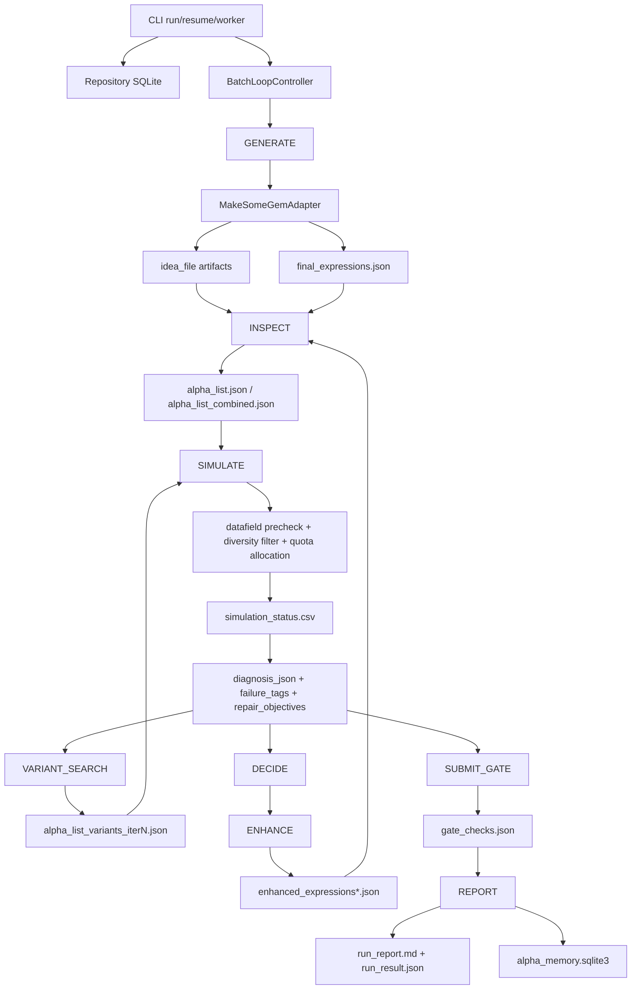

# brain_agent Tutorial

这份文档面向两类场景：

- 你要向别人介绍 `brain_agent` 的整体设计。
- 你自己想优化这个系统，需要先知道每一步到底消费什么输入、产生什么输出、状态如何被记录，以及 24 小时自动化工作流为什么能持续跑下去。

`brain_agent` 的核心定位不是一个单步脚本，而是一个本地 WorldQuant BRAIN alpha mining 编排器。它把生成、检查、仿真、诊断、变体搜索、增强、gate 检查、报告和长期记忆连接成一个可追踪的研究系统。legacy skills 仍然承担实际生成、检查、仿真等能力，但用户和维护者默认应该通过 `brain_agent` 进入，这样所有活动都会进入 `.brain_runtime`、SQLite、任务日志和研究报告。

## 1. 一句话总览

`brain_agent` 把一个 `RunConfig` 变成一条可审计的研究流水线：

```text
RunConfig
  -> GENERATE       生成 idea files 和 final_expressions.json
  -> INSPECT        转成带 BRAIN settings 的 alpha_list.json
  -> SIMULATE       预检、排序、分配 quota、提交 batch simulation
  -> DIAGNOSE       解析 simulation_status.csv，打 failure_tags 和 repair_objectives
  -> VARIANT_SEARCH 基于失败模式和 lineage 生成局部变体
  -> SIMULATE       仿真变体
  -> DECIDE         选择值得增强的 candidates
  -> ENHANCE        用诊断上下文生成增强表达式
  -> SUBMIT_GATE    只做提交前检查，不自动 submit
  -> REPORT         写 run_report.md、run_result.json，并写入 alpha memory
```

真实长跑时，`worker --mode drain --refill-on-empty` 会把这个流程变成近似 24 小时队列：

```text
pending/retryable candidates
  -> pick top scored batch
  -> write alpha_list_worker_batch<N>.json
  -> batch simulate
  -> update candidates and sim_results
  -> repeat until quota/time/batch limit
  -> if queue empty and refill enabled: GENERATE + INSPECT + field_factory, then continue
```

## 2. 运行时目录和数据库是系统骨架

典型命令都从仓库根目录运行：

```bash
PYTHONPATH=.. python3 -m brain_agent --runtime-root .brain_runtime <command> ...
```

每个 run 有一个独立目录：

```text
.brain_runtime/runs/<run_id>/
  brain_agent.sqlite3
  run_report.md
  run_result.json
  export.json
  artifacts/
    01_generate/
    02_inspect/
    03_simulate/
    04_variants/
    04_enhance/
    06_gate/
    imported/
  tasks/
    <task_id>/
      stdout.log
      stderr.log
  worker_stats/
    worker_stats.json
```

SQLite 是状态中心，主要表如下：

| 表 | 作用 |
|---|---|
| `runs` | run_id、RunConfig、当前 stage、stop_reason、创建和更新时间 |
| `tasks` | 被 TaskRunner 启动的外部 legacy 脚本任务、pid、状态、stdout/stderr 路径 |
| `artifacts` | 每个阶段产生或导入的文件、kind、path、sha256、source_stage |
| `candidates` | alpha 表达式、fingerprint、status、alpha_id、lineage、thesis、selection_score |
| `sim_results` | 每次仿真结果、指标、错误、failure_tags、repair_objectives、diagnosis_json |
| `gate_checks` | submission/self/prod/weight/subuniverse 检查结果 |
| `decisions` | 每轮 DECIDE 选择了什么增强动作，以及输入候选快照 |

这也是 `brain_agent` 比直接跑 legacy scripts 更重要的地方：它不仅“跑出结果”，还保留了为什么跑、跑了什么、失败在哪里、下一次如何修的证据链。

## 3. RunConfig 输入

`run` 命令的第一层输入是 CLI 参数或 preset，最后都会被归一化成 `RunConfig`。常见命令：

```bash
PYTHONPATH=.. python3 -m brain_agent --runtime-root .brain_runtime run \
  --run-id fundamental31_eur_dayrun \
  --dataset fundamental31 \
  --preset eur_top2500_slow_fast \
  --target-ready 1 \
  --max-iterations 6 \
  --max-sim-alphas 500 \
  --max-variant-alphas 20 \
  --max-variants-per-alpha 4
```

对应的 `config_json` 大致像这样：

```json
{
  "dataset": "fundamental31",
  "region": "EUR",
  "delay": 1,
  "universe": "TOP2500",
  "data_type": "MATRIX",
  "decay": 10,
  "truncation": 0.08,
  "neutralization": "SLOW_AND_FAST",
  "max_trade": false,
  "target_ready": 1,
  "max_iterations": 6,
  "batch_size": 10,
  "concurrency": 8,
  "dry_run": false,
  "max_fields": null,
  "max_operators": null,
  "max_sim_alphas": 500,
  "max_variant_alphas": 20,
  "max_variants_per_alpha": 4,
  "use_llm_decide": false,
  "max_enhance_actions": 4,
  "make_prompt_version": "make-v1",
  "enhance_prompt_version": "enhance-v1",
  "decision_prompt_version": "decision-v1",
  "prompt_experiment": ""
}
```

默认 slot policy：

| Region | batch_size | concurrency | 一批理论容量 |
|---|---:|---:|---:|
| 非 GLB | 10 | 8 | 80 |
| GLB | 4 | 4 | 16 |

`max_sim_alphas` 只作用在普通 `run` 的一次 simulation quota 分配中。`worker` 会把 config 的 `max_sim_alphas` 替换为 `None`，然后由 `--max-total-alphas` 和每批上限控制 24 小时总量。

## 4. 总 workflow



`BatchLoopController` 的真实运行逻辑有一个关键点：它会先完成 GENERATE 和 INSPECT，得到 combined alpha list；然后在每个 iteration 中跑 SIMULATE、可选 VARIANT_SEARCH、DECIDE、可选 ENHANCE、SUBMIT_GATE。达到 `target_ready` 后提前结束，否则到 `max_iterations` 后写报告。

## 5. 阶段 1: GENERATE

### 目标

从 dataset、region、universe、data_type、approved lessons 等上下文中生成 alpha ideas 和 raw/final expressions。

### 执行者

- `MakeSomeGemAdapter`
- legacy runner: `.agents/skills/brain-makeSomeGem/scripts/headless_runner/run.py`

### 输入

主要输入是 `RunConfig`：

```json
{
  "dataset": "fundamental31",
  "region": "EUR",
  "delay": 1,
  "universe": "TOP2500",
  "data_type": "MATRIX",
  "max_fields": 6,
  "max_operators": 80,
  "make_prompt_version": "make-v1"
}
```

adapter 还会设置一些环境变量：

```text
BRAIN_EMAIL / BRAIN_PASSWORD
LLM_PROVIDER / LLM_API_KEY / LLM_BASE_URL / LLM_MODEL
APPROVED_FORUM_LESSONS_QUERY="fundamental31 EUR MATRIX SLOW_AND_FAST fundamental"
```

### 输出文件

常见 artifact：

```text
artifacts/01_generate/final_expressions.json
artifacts/01_generate/<dataset>_<region>_delay<delay>_idea_<N>.json
artifacts/01_generate/final_expressions_factor_theses.json
```

`final_expressions.json` 可以是字符串数组，也可以是对象数组。示例：

```json
[
  {
    "expression": "rank(ts_mean(fnd31_revenue_growth, 20))",
    "idea_file": "fundamental31_EUR_delay1_idea_001.json",
    "rationale": "Use short-window revenue growth as a peer-relative growth signal."
  },
  {
    "expression": "-rank(ts_delta(fnd31_accruals, 60))",
    "idea_file": "fundamental31_EUR_delay1_idea_002.json",
    "rationale": "Penalize deteriorating accrual quality."
  }
]
```

一个 idea file 的内容通常更像研究假设。示例：

```json
{
  "dataset_id": "fundamental31",
  "region": "EUR",
  "delay": 1,
  "idea": "European large-cap companies with improving profitability quality may outperform peers.",
  "fields": ["fnd31_gross_margin", "fnd31_accruals"],
  "operators": ["ts_mean", "ts_delta", "rank", "group_neutralize"],
  "candidate_templates": [
    "rank(ts_mean(<profitability_field>, 20))",
    "-rank(ts_delta(<accrual_field>, 60))"
  ]
}
```

`parse_final_expressions` 会把每个 expression upsert 到 `candidates`，初始 status 是 `generated`，并写入：

- `expression`
- `fingerprint`
- `idea_file`
- `source=makeSomeGem`
- `thesis_json`

`factor_theses` 示例：

```json
[
  {
    "candidate_id": 12,
    "fingerprint": "a7d1...",
    "expression": "rank(ts_mean(fnd31_revenue_growth, 20))",
    "factor_thesis": {
      "thesis_type": "growth_quality",
      "field_families": ["fundamental31"],
      "operator_themes": ["time_series_smoothing", "cross_sectional_rank"],
      "thesis_text": "A smoothed revenue growth signal should rank improving firms above peers.",
      "expected_failure_modes": ["low_fitness", "high_turnover"],
      "intended_repair_methods": ["decay_sweep", "group_neutralize", "turnover_control"]
    }
  }
]
```

### 数据库状态变化

```text
runs.stage = GENERATE
artifacts += final_expressions, idea_file, factor_theses
candidates += generated candidates
tasks += makeSomeGem task with stdout/stderr
```

## 6. 阶段 2: INSPECT

### 目标

把 raw idea/expression 转成 BRAIN 能直接提交 simulation 的 `alpha_list.json`。这一步会补齐 settings，过滤明显无法提交的表达式，并把候选状态改成 `sim_pending`。

### 执行者

- `InspectRawTemplateAdapter`
- legacy process script: `.agents/skills/brain-inspectRawTemplate-create-Setting/scripts/process_template.py`
- legacy build script: `.agents/skills/brain-inspectRawTemplate-create-Setting/scripts/build_alpha_list.py`
- field factory: adapter 内置的 datafield metadata 直接造 alpha list 能力

### 输入

来自 GENERATE 的 idea file：

```text
artifacts/01_generate/fundamental31_EUR_delay1_idea_001.json
```

以及 config 中的 settings：

```json
{
  "region": "EUR",
  "delay": 1,
  "universe": "TOP2500",
  "instrumentType": "EQUITY",
  "dataType": "MATRIX",
  "decay": 10,
  "truncation": 0.08,
  "neutralization": "SLOW_AND_FAST",
  "maxTrade": false
}
```

### 输出文件

每个 idea 通常产生：

```text
artifacts/02_inspect/<idea_stem>/idea_context.json
artifacts/02_inspect/<idea_stem>/settings_candidates.json
artifacts/02_inspect/<idea_stem>/alpha_list.json
```

field factory 还会产生：

```text
artifacts/02_inspect/datafields/<dataset>_<region>_delay<delay>_<universe>_<data_type>.json
artifacts/02_inspect/alpha_list_field_factory.json
```

最终合并：

```text
artifacts/02_inspect/alpha_list_combined.json
```

`alpha_list.json` 示例：

```json
[
  {
    "type": "REGULAR",
    "settings": {
      "instrumentType": "EQUITY",
      "region": "EUR",
      "universe": "TOP2500",
      "delay": 1,
      "decay": 10,
      "neutralization": "SLOW_AND_FAST",
      "truncation": 0.08,
      "pasteurization": "ON",
      "unitHandling": "VERIFY",
      "nanHandling": "OFF",
      "language": "FASTEXPR",
      "visualization": false
    },
    "regular": "rank(ts_mean(fnd31_revenue_growth, 20))",
    "idea_file": "artifacts/01_generate/fundamental31_EUR_delay1_idea_001.json",
    "factor_thesis": {
      "thesis_type": "growth_quality",
      "field_families": ["fundamental31"],
      "operator_themes": ["time_series_smoothing", "cross_sectional_rank"]
    }
  }
]
```

`settings_candidates.json` 示例：

```json
[
  {
    "region": "EUR",
    "universe": "TOP2500",
    "delay": 1,
    "data_type": "MATRIX",
    "neutralization": "SLOW_AND_FAST",
    "score": 0.92,
    "reason": "Matches requested preset and data type."
  }
]
```

### 数据库状态变化

`parse_alpha_list` 会为每行 alpha list 计算 fingerprint。fingerprint 包含 expression 和 settings，所以同一个 expression 在不同 region/universe/neutralization 下会被视作不同 candidate。

```text
runs.stage = INSPECT
artifacts += idea_context, settings_candidates, alpha_list, alpha_list_field_factory, alpha_list_combined
candidates.generated -> candidates.sim_pending
candidates.selection_score updated
```

### 重要细节

INSPECT 会跳过 unresolved bare variable。例如表达式里残留 `divide(apg, fnd31_...)` 这种裸 `apg` token，会在进入 simulation 前被过滤，避免浪费 BRAIN quota。

## 7. 阶段 3: SIMULATE

### 目标

把 `alpha_list.json` 提交给 BRAIN simulation，追踪 batch/child simulation，解析 CSV，更新 candidate 状态和指标。

### 执行者

- `BatchSimAdapter`
- legacy batch simulator: `.agents/skills/brain-simAlphasinBatch-and-track/scripts/batch_simulator.py`

### 输入

通常是：

```text
artifacts/02_inspect/alpha_list_combined.json
```

或者 worker 生成的：

```text
artifacts/02_inspect/alpha_list_worker_batch<N>.json
```

adapter 在真正提交前会做四层处理：

1. score sorting: 写 `*_score_sorted.json`，优先提交 selection_score 高的候选。
2. quota allocation: 如果 `max_sim_alphas` 有值，写 `*_quota<N>.json` 和 quota report。
3. datafield preflight: 检查表达式中的字段在目标 dataset/settings 是否可用。
4. batch diversity filter: 限制一批里过度重复的普通结构。

### 中间输出文件

```text
artifacts/03_simulate/input/alpha_list_combined.json
artifacts/03_simulate/input/alpha_list_combined_score_sorted.json
artifacts/03_simulate/input/alpha_list_combined_score_sorted_quota500.json
artifacts/03_simulate/input/alpha_list_combined_score_sorted_quota500_report.json
artifacts/03_simulate/datafields/fundamental31_EUR_delay1_TOP2500_MATRIX.json
artifacts/03_simulate/simulation_precheck_status.csv
artifacts/03_simulate/alpha_list_diversity_report.json
artifacts/03_simulate/alpha_list_diversity_rejected.json
```

quota report 示例：

```json
{
  "limit": 500,
  "input_count": 2200,
  "selected_count": 500,
  "buckets": {
    "exploit": 250,
    "explore": 125,
    "repair": 125
  },
  "notes": [
    "Memory-backed candidates received exploit priority.",
    "Duplicate clusters were penalized."
  ]
}
```

datafield preflight cache 示例：

```json
{
  "dataset": "fundamental31",
  "region": "EUR",
  "delay": 1,
  "universe": "TOP2500",
  "data_type": "MATRIX",
  "field_ids": [
    "fnd31_revenue_growth",
    "fnd31_accruals",
    "fnd31_gross_margin"
  ]
}
```

如果字段缺失，precheck 会写一条本地失败 CSV，而不是提交给 BRAIN：

```csv
fingerprint,regular_expression,settings_json,sim_id,status,alpha_id,pnl,sharpe,turnover,fitness,error,error_details
abc123,"rank(ts_mean(fnd31_missing_field,20))","{""region"":""EUR""}",precheck_missing_fields_0,PRECHECK_FAILED,,,,,"Datafield not available in target universe: fnd31_missing_field","{""missing_datafields"":[""fnd31_missing_field""]}"
```

### 最终输出文件

```text
artifacts/03_simulate/simulation_status.csv
```

示例：

```csv
fingerprint,regular_expression,settings_json,sim_id,status,alpha_id,pnl,sharpe,turnover,fitness,returns,drawdown,error,error_details
abc123,"rank(ts_mean(fnd31_revenue_growth,20))","{""region"":""EUR"",""delay"":1}",sim_001,COMPLETE,ALPHA001,12345.6,1.21,0.18,0.91,0.045,0.022,,
def456,"-rank(ts_delta(fnd31_accruals,60))","{""region"":""EUR"",""delay"":1}",sim_002,COMPLETE,ALPHA002,8000.0,0.42,0.74,0.18,0.012,0.031,,
ghi789,"rank(ts_mean(fnd31_missing,20))","{""region"":""EUR"",""delay"":1}",precheck_missing_fields_0,PRECHECK_FAILED,,,,,,,"Datafield not available in target universe: fnd31_missing"
```

### 数据库状态变化

`parse_simulation_status` 会写 `sim_results`，然后根据指标和错误分类 candidate：

| simulation/metrics 情况 | candidate status |
|---|---|
| 强指标或接近可检查 | `promising` 或 `manual_review` |
| 有修复价值 | `needs_enhance` |
| 平台临时错误、timeout、spawn failed | `sim_retryable` |
| 硬错误或指标太差 | `sim_failed` 或 `rejected` |

每条 sim result 还会写：

```json
{
  "candidate_id": 12,
  "alpha_id": "ALPHA001",
  "status": "COMPLETE",
  "sharpe": 1.21,
  "fitness": 0.91,
  "turnover": 0.18,
  "failure_tags": [],
  "repair_objectives": [],
  "diagnosis": {
    "failure_tags": [],
    "repair_objectives": [],
    "diagnosis_reasons": ["Simulation metrics satisfy local promising thresholds."],
    "repair_hints": []
  }
}
```

失败诊断示例：

```json
{
  "candidate_id": 13,
  "alpha_id": "ALPHA002",
  "status": "COMPLETE",
  "sharpe": 0.42,
  "fitness": 0.18,
  "turnover": 0.74,
  "failure_tags": ["low_fitness", "high_turnover"],
  "repair_objectives": ["improve_fitness", "reduce_turnover"],
  "diagnosis": {
    "diagnosis_reasons": [
      "Fitness is below local threshold.",
      "Turnover is above the preferred range."
    ],
    "repair_hints": [
      "Try decay/hump/trade_when wrappers.",
      "Prefer cleaner preprocessing before adding more fields."
    ]
  }
}
```

### 长等待不是失败

batch simulator 的 polling 是防御式的。父 batch、child simulation、单 simulation 状态读取遇到 HTTP、JSON、空响应等瞬时问题时会重试。长时间等待会触发 15 分钟一次的 BRAIN session health check 和认证刷新。看到 `[BRAIN wait]` 或 `[BRAIN healthcheck]` 不等于 alpha 失败。

## 8. 阶段 4: VARIANT_SEARCH

### 目标

在已有仿真结果的基础上，对弱信号、repairable、或 gate/correlation 有问题的 candidates 做本地 deterministic 变体搜索。

### 执行者

- `VariantSearchAdapter`
- `pipeline/variant_search.py`
- `pipeline/optimizers.py`

### 输入

```text
artifacts/02_inspect/alpha_list_combined.json
SQLite candidates
SQLite latest sim_results
SQLite latest gate_checks
optional artifacts/pnl_cache.json
```

### 输出文件

```text
artifacts/04_variants/alpha_list_variants_iter1.json
artifacts/04_variants/variant_search_report_iter1.json
```

变体 alpha list 示例：

```json
[
  {
    "type": "REGULAR",
    "settings": {
      "region": "EUR",
      "universe": "TOP2500",
      "delay": 1,
      "neutralization": "SLOW_AND_FAST"
    },
    "regular": "rank(ts_decay_linear(ts_mean(fnd31_revenue_growth,20),5))",
    "parent_candidate_id": 12,
    "variant_strategy": "decay_sweep",
    "variant_params": {
      "decay": 5
    },
    "lineage": {
      "parent_candidate_id": 12,
      "variant_strategy": "decay_sweep",
      "source_expression": "rank(ts_mean(fnd31_revenue_growth,20))"
    }
  }
]
```

variant report 示例：

```json
{
  "iteration": 1,
  "input_candidates": 80,
  "selected_parents": 12,
  "variant_count": 36,
  "strategies": {
    "decay_sweep": 10,
    "turnover_control": 8,
    "short_flip": 4,
    "coverage_repair": 6,
    "rank_zscore_swap": 8
  }
}
```

### 数据库状态变化

这些变体会被 `parse_alpha_list` 当作新 candidates 写入：

```text
candidates.status = sim_pending
candidates.parent_candidate_id = <parent>
candidates.variant_strategy = decay_sweep / high_turnover / coverage_repair / ...
candidates.variant_params = {...}
candidates.lineage_json = {...}
```

然后 controller 会把 `alpha_list_variants_iter<N>.json` 再送回 SIMULATE。报告阶段会比较 parent 和 variant 的 Sharpe/Fitness/Turnover delta。

## 9. 阶段 5: DECIDE

### 目标

从 `promising` 和 `needs_enhance` candidates 里挑选值得增强的对象，写入 decision journal。

### 执行者

- `DecisionEngine`
- 默认 rule-based
- 可选 `--use-llm-decide`

### 输入

来自 `_enhance_inputs()` 的 enriched candidate 列表：

```json
[
  {
    "candidate_id": 12,
    "status": "needs_enhance",
    "alpha_id": "ALPHA002",
    "expression": "-rank(ts_delta(fnd31_accruals,60))",
    "selection_score": 0.73,
    "failure_tags": ["cand_neg"],
    "repair_objectives": ["test_short_flip"],
    "latest_sim_result": {
      "sharpe": -1.1,
      "fitness": -0.8,
      "turnover": 0.21
    },
    "diagnosis": {
      "repair_hints": ["Try sign flip or short_flip enhancement."]
    }
  }
]
```

### 输出数据库记录

写入 `decisions` 表。示例：

```json
{
  "iteration": 1,
  "action": [
    {
      "mode": "single",
      "style": "short_flip",
      "candidate_ids": [12],
      "reason": "Rule fallback detected a strong negative signal.",
      "source": "rules"
    }
  ],
  "reason": "Rule-based selected promising/needs_enhance candidates for template enhancement.",
  "input_candidates_json": [
    {
      "candidate_id": 12,
      "selection_score": 0.73,
      "repair_objectives": ["test_short_flip"]
    }
  ]
}
```

### 重要限制

LLM decision 只能建议 enhancement action，不能把候选标记为 `submit_ready`。提交资格必须由 hard gate 检查决定。

## 10. 阶段 6: ENHANCE

### 目标

基于 idea files、候选指标和诊断上下文生成增强表达式。增强可以修复 turnover、弱 fitness、负信号、coverage 等问题，但会被复杂度和多样性约束过滤。

### 执行者

- `EnhanceTemplateAdapter`
- legacy runner: `.agents/skills/brain-enhance-template/scripts/run.py`

### 输入

来源包括：

```text
candidate idea files
DECIDE selected candidate ids
latest simulation diagnostics
RunConfig
approved forum lessons query
```

adapter 会写诊断上下文：

```text
artifacts/04_enhance/enhance_complexity_budget.json
artifacts/04_enhance/enhance_diagnostics_context.json
artifacts/04_enhance/input/<idea_file>.json
```

`enhance_complexity_budget.json` 示例：

```json
{
  "max_operators": 5,
  "max_datafields": 4,
  "policy": "Enhancement may clean, smooth, or repair an alpha, but should not keep adding fields/operators.",
  "batch_diversity": {
    "max_common_operator_repeats": 2,
    "target_min_structural_themes": 4
  }
}
```

`enhance_diagnostics_context.json` 示例：

```json
{
  "complexity_budget": {
    "max_operators": 5,
    "max_datafields": 4
  },
  "candidates": [
    {
      "candidate_id": 12,
      "alpha_id": "ALPHA002",
      "expression": "-rank(ts_delta(fnd31_accruals,60))",
      "metrics": {
        "sharpe": -1.1,
        "fitness": -0.8,
        "turnover": 0.21
      },
      "failure_tags": ["cand_neg"],
      "repair_objectives": ["test_short_flip"]
    }
  ]
}
```

### 输出文件

```text
artifacts/04_enhance/enhanced_final_expressions_<timestamp>.json
artifacts/04_enhance/enhanced_final_expressions_<timestamp>_complexity_filtered.json
artifacts/04_enhance/enhanced_final_expressions_<timestamp>_complexity_rejected.json
artifacts/04_enhance/enhanced_expressions_diversity_report.json
artifacts/04_enhance/enhanced_expressions_diversity_rejected.json
artifacts/04_enhance/enhanced_final_expressions_<timestamp>_factor_theses.json
```

enhanced expression 示例：

```json
[
  {
    "expression": "rank(ts_delta(fnd31_accruals,60))",
    "source_candidate_id": 12,
    "repair_intent": "short_flip",
    "notes": "Original candidate had strong negative signal."
  },
  {
    "expression": "trade_when(volume > adv20, rank(ts_decay_linear(ts_delta(fnd31_accruals,60),5)), -1)",
    "source_candidate_id": 12,
    "repair_intent": "turnover_control"
  }
]
```

### 数据库状态变化

增强表达式会通过 `MakeSomeGemAdapter.parse_final_expressions` 写回 candidates：

```text
artifacts += enhanced_expressions, rejected files, diversity report
candidates += generated enhanced candidates
decisions += enhance_result with produced artifacts
```

如果增强产生新 candidates，controller 会用 `write_alpha_list_for_candidates` 写：

```text
artifacts/02_inspect/alpha_list_enhanced_iter<N>.json
```

然后下一轮 SIMULATE 会仿真这些增强候选。

## 11. 阶段 7: SUBMIT_GATE

### 目标

只检查，不自动 submit。它会对 `promising` 和 `manual_review` 且已有 `alpha_id` 的 candidates 调 BRAIN 检查：

- submission check
- self correlation check
- production correlation check
- weight check
- subuniverse check

### 执行者

- `SubmissionGateAdapter`
- `brain-shared/scripts/ace_lib`

### 输入

SQLite candidates：

```json
[
  {
    "candidate_id": 12,
    "alpha_id": "ALPHA001",
    "status": "promising",
    "fingerprint": "abc123"
  }
]
```

### 输出文件

```text
artifacts/06_gate/gate_checks.json
```

示例：

```json
[
  {
    "candidate_id": 12,
    "alpha_id": "ALPHA001",
    "submission_check": "PASS",
    "self_corr_check": "PASS",
    "prod_corr_check": "PASS",
    "weight_check": "PASS",
    "subuniverse_check": "PASS",
    "gate_status": "complete",
    "error_type": "",
    "incomplete_checks": [],
    "error": "",
    "passed": true
  }
]
```

如果 gate 由于认证、平台、某个检查接口失败而不完整，会保留不完整状态：

```json
{
  "candidate_id": 13,
  "alpha_id": "ALPHA002",
  "submission_check": "PASS",
  "self_corr_check": "",
  "prod_corr_check": "",
  "weight_check": "PASS",
  "subuniverse_check": "PASS",
  "gate_status": "incomplete",
  "error_type": "platform_error",
  "incomplete_checks": ["self_corr_check", "prod_corr_check"],
  "error": "Temporary platform response error.",
  "passed": false
}
```

### 数据库状态变化

```text
gate_checks += each alpha check result
if passed: candidate.status -> submit_ready
if not passed: status remains promising/manual_review/needs_enhance depending on prior state
```

安全边界非常重要：`brain_agent gate` 和 `report` 不会提交 alpha。除非用户明确指定 alpha IDs 并确认提交，否则不要调用任何生产 submission path。

## 12. 阶段 8: REPORT 和 MEMORY

### 目标

把整条流水线转成研究日志、机器可读结果和长期记忆。

### 执行者

- `reporting.write_report`
- `AlphaMemory.ingest_run`

### 输入

整个 SQLite run state：

```text
runs
tasks
artifacts
candidates
sim_results
gate_checks
decisions
```

### 输出文件

```text
run_report.md
run_result.json
```

`run_result.json` 顶层结构示例：

```json
{
  "run": {
    "run_id": "fundamental31_eur_dayrun",
    "stage": "DONE",
    "stop_reason": "target_ready reached: 1"
  },
  "config": {
    "dataset": "fundamental31",
    "region": "EUR"
  },
  "counts": {
    "sim_pending": 0,
    "promising": 3,
    "needs_enhance": 5,
    "submit_ready": 1,
    "sim_failed": 20
  },
  "candidates": [],
  "sim_results": [],
  "gate_checks": [],
  "decisions": [],
  "tasks": [],
  "artifacts": [],
  "prompt_metrics": {
    "score": 0.61,
    "valid_rate": 0.88,
    "sim_success_rate": 0.52,
    "avg_sharpe": 0.43,
    "avg_fitness": 0.21
  }
}
```

`run_report.md` 包含：

```text
Executive Summary
Experiment Setup
Run Outcome
Prompt Metrics
Research Timeline
Decision Journal
Submit Ready Alpha IDs
Suggested Manual Submission Order
Failure Diagnostics
Quota Waste Analysis
Gate Incomplete Summary
Factor Thesis Summary
Variant Search
Variant Strategy Effectiveness
Candidate Lifecycle
Artifact Ledger
Task Ledger
Next Research Recommendations
Lessons And Next Steps
Reproduction
```

报告还会自动 ingest 到：

```text
.brain_runtime/alpha_memory.sqlite3
```

memory 记录两层：

- `memory_run_summaries`: 每个 run 的总体表现。
- `memory_candidate_observations`: 每个 candidate 的表达式、状态、指标、operators、field families、failure tags、gate 是否通过。

后续 scoring 会读取 memory context，用历史经验影响 candidate 排序和 quota allocation。

## 13. 24 小时自动化工作流

### 推荐启动方式

第一步先创建一个 run，可以小规模生成和 inspect：

```bash
PYTHONPATH=.. python3 -m brain_agent --runtime-root .brain_runtime run \
  --run-id analyst69_eur_24h \
  --dataset analyst69 \
  --preset eur_top2500_slow_fast \
  --target-ready 4 \
  --max-iterations 1 \
  --max-sim-alphas 80
```

然后交给 worker drain：

```bash
PYTHONPATH=.. python3 -m brain_agent --runtime-root .brain_runtime worker \
  --run-id analyst69_eur_24h \
  --mode drain \
  --max-total-alphas 5000 \
  --refill-on-empty \
  --max-empty-refills 0
```

如果要限制 24 小时：

```bash
PYTHONPATH=.. python3 -m brain_agent --runtime-root .brain_runtime worker \
  --run-id analyst69_eur_24h \
  --mode drain \
  --max-runtime-hours 24 \
  --max-total-alphas 5000 \
  --refill-on-empty \
  --max-empty-refills 0
```

### worker 的循环

`SimulationWorker.run_drain` 的每轮逻辑：

1. 检查是否收到 SIGINT/SIGTERM。
2. 检查 runtime hours、max batches、max total alphas 是否达到上限。
3. 查找 `sim_pending` 和 `sim_retryable` candidates。
4. 对 retryable candidates 计算重试次数，超过 `--max-retries` 标成 `sim_failed`。
5. 按 `selection_score` 和 `candidate_id` 排序。
6. 按 `--batch-candidates-limit` 或 `batch_size * concurrency` 截断。
7. 写 `alpha_list_worker_batch<N>.json`。
8. 调 batch simulation。
9. 解析 simulation_status，更新 candidate status、sim_results、scores。
10. 写 `worker_stats/worker_stats.json`。
11. 如果队列空且 `--refill-on-empty`，跑 GENERATE + INSPECT + field_factory，再继续。

### worker 输入输出

输入：

```json
{
  "run_id": "analyst69_eur_24h",
  "mode": "drain",
  "max_total_alphas": 5000,
  "max_retries": 3,
  "batch_candidates_limit": 0,
  "refill_on_empty": true,
  "max_empty_refills": null
}
```

每批写出的 alpha list：

```text
artifacts/02_inspect/alpha_list_worker_batch1.json
artifacts/02_inspect/alpha_list_worker_batch2.json
...
```

worker stats 示例：

```json
{
  "batches_completed": 18,
  "total_submitted": 1440,
  "total_succeeded": 810,
  "total_failed": 320,
  "total_retryable": 310,
  "total_retired": 0,
  "start_time": "2026-06-02T00:10:00+08:00",
  "end_time": "",
  "elapsed_seconds": 21600,
  "throughput_per_hour": 240.0,
  "errors": []
}
```

### 24 小时节奏示例

| 时间段 | 系统行为 | 你应该看什么 |
|---|---|---|
| 00:00-00:30 | 创建 run，生成第一批 ideas，inspect 成 alpha list | `status`、`tasks --refresh`、`artifacts/01_generate` |
| 00:30-03:00 | worker 连续提交 pending batches | `worker_stats.json`、simulation progress |
| 03:00-06:00 | retryable candidates 回流，失败 candidates 被诊断 | `sim_results.failure_tags`、`run_report.md` |
| 06:00-12:00 | 队列消耗后自动 refill，生成新一批 candidates | worker stdout 中的 `refill #N` |
| 12:00-18:00 | memory/scoring 开始影响排序，quota 优先给高分 candidates | `selection_score`、`score_breakdown` |
| 18:00-23:30 | 接近 daily quota 或 runtime limit，worker 继续 drain | `total_submitted`、`throughput_per_hour` |
| 23:30-24:00 | 停止 worker，刷新 report 和 gate | `report`、`gate`、submit-ready IDs |

### 监控命令

```bash
PYTHONPATH=.. python3 -m brain_agent --runtime-root .brain_runtime status --run-id analyst69_eur_24h
```

输出示例：

```json
{
  "run_id": "analyst69_eur_24h",
  "stage": "SIMULATE",
  "stop_reason": "",
  "counts": {
    "candidates": 1830,
    "submit_ready": 0,
    "promising": 22,
    "needs_enhance": 41
  },
  "run_dir": ".brain_runtime/runs/analyst69_eur_24h",
  "simulation": {
    "total": 80,
    "completed": 47,
    "failed": 5,
    "running": 8,
    "remaining": 20
  },
  "worker_stats": {
    "batches_completed": 18,
    "total_submitted": 1440,
    "throughput_per_hour": 240.0
  }
}
```

查看任务：

```bash
PYTHONPATH=.. python3 -m brain_agent --runtime-root .brain_runtime tasks \
  --run-id analyst69_eur_24h \
  --refresh
```

如果某个 batch 看起来卡住：

1. 先用 `tasks --refresh`。
2. 读对应 task 的 `stdout.log` 和 `stderr.log`。
3. 找 `[BRAIN wait]` 和 `[BRAIN healthcheck]`。
4. 如果只是 Retry-After 或 healthcheck，继续等。
5. 如果进程失败且 candidates 变成 `sim_retryable`，让 worker 自动重试或跑 `retry-sim`。

## 14. retry-sim 工作流

`retry-sim` 是从 SQLite 里找 `sim_retryable` candidates，重新写一个干净 alpha list，再可选提交。

命令：

```bash
PYTHONPATH=.. python3 -m brain_agent --runtime-root .brain_runtime retry-sim \
  --run-id analyst69_eur_24h \
  --limit 100 \
  --batch-size 10 \
  --concurrency 8 \
  --dry-run
```

输入：

```text
candidates.status = sim_retryable
RunConfig
optional --limit
```

输出：

```text
artifacts/02_inspect/alpha_list_retryable.json
```

CLI 输出示例：

```json
{
  "run_id": "analyst69_eur_24h",
  "retryable_count": 100,
  "alpha_list": ".brain_runtime/runs/analyst69_eur_24h/artifacts/02_inspect/alpha_list_retryable.json",
  "submitted": false
}
```

去掉 `--dry-run` 后会直接送入 batch simulation。

## 15. parse-artifact 工作流

如果 legacy 或外部流程已经产生了文件，可以导入到当前 run，让 `brain_agent` 接管状态。

### 导入 final expressions

```bash
PYTHONPATH=.. python3 -m brain_agent --runtime-root .brain_runtime parse-artifact \
  --run-id analyst69_eur_24h \
  --kind final_expressions \
  --path /path/to/final_expressions.json
```

输入示例：

```json
[
  "rank(ts_mean(analyst69_eps_revision,20))",
  {
    "expression": "rank(ts_delta(analyst69_target_price,60))",
    "idea_file": "external_idea.json"
  }
]
```

输出：

```text
artifacts/imported/generate/final_expressions.json
candidates.status = generated
```

### 导入 alpha list

```bash
PYTHONPATH=.. python3 -m brain_agent --runtime-root .brain_runtime parse-artifact \
  --run-id analyst69_eur_24h \
  --kind alpha_list \
  --path /path/to/alpha_list.json
```

输出：

```text
artifacts/imported/inspect/alpha_list.json
candidates.status = sim_pending
```

### 导入 simulation status

```bash
PYTHONPATH=.. python3 -m brain_agent --runtime-root .brain_runtime parse-artifact \
  --run-id analyst69_eur_24h \
  --kind simulation_status \
  --path /path/to/simulation_status.csv
```

输出：

```text
artifacts/imported/simulate/simulation_status.csv
sim_results += parsed rows
candidates.status updated by metrics/diagnosis
```

## 16. forum learning 和 knowledge policy

论坛学习是辅助研究，不会自动变成系统知识。

### 学习论坛

```bash
PYTHONPATH=.. python3 -m brain_agent --runtime-root .brain_runtime forum learn \
  "turnover submit fitness" \
  --read-top 3 \
  --format markdown \
  --output .brain_runtime/forum_learning/turnover_submit_fitness.md
```

输出是 review artifact：

```text
.brain_runtime/forum_learning/turnover_submit_fitness.md
```

里面可能包含 proposed lessons，但这还不是 active knowledge。

### 批准 lesson

```bash
PYTHONPATH=.. python3 -m brain_agent --runtime-root .brain_runtime knowledge approve-forum-lesson \
  --report .brain_runtime/forum_learning/turnover_submit_fitness.md \
  --title "Use turnover control wrappers before adding new fields"
```

批准后，lesson 会进入 compact knowledge path，之后 MakeSomeGemAdapter 和 EnhanceTemplateAdapter 会用 `APPROVED_FORUM_LESSONS_QUERY` 检索相关经验。

原则：不要把论坛全文直接粘进 prompt 或代码。把它规整成结构化 policy 或 approved lesson。

## 17. 状态生命周期

candidate status 是理解系统的关键：

```text
generated
  -> sim_pending
  -> sim_retryable
  -> sim_failed
  -> promising
  -> needs_enhance
  -> manual_review
  -> submit_ready
  -> rejected
```

常见路径：

```text
GENERATE produces expression
  -> generated
INSPECT writes alpha_list
  -> sim_pending
SIMULATE complete with good metrics
  -> promising
SUBMIT_GATE all pass
  -> submit_ready
```

另一条路径：

```text
SIMULATE complete with weak metrics but repairable
  -> needs_enhance
DECIDE selects it
  -> ENHANCE creates new expression
INSPECT new expression
  -> sim_pending
SIMULATE again
```

平台临时失败路径：

```text
SIMULATE timeout / spawn failed / transient platform failure
  -> sim_retryable
worker or retry-sim retries
  -> if too many retryable results: sim_failed
```

## 18. 优化时应该先看哪里

如果你想优化生成质量：

- `intelligence/prompting.py`
- `pipeline/adapters.py` 中 `MakeSomeGemAdapter`
- `intelligence/knowledge.py`
- `analysis/memory.py`
- `analysis/quality.py`
- `run_report.md` 的 Prompt Metrics 和 Failure Diagnostics

如果你想优化仿真 quota 使用：

- `pipeline/quota_allocator.py`
- `analysis/scoring.py`
- `analysis/selection.py`
- `BatchSimAdapter._score_sorted_alpha_list`
- `BatchSimAdapter._allocate_alpha_list_quota`
- `BatchSimAdapter._filter_alpha_list_by_batch_diversity`
- 报告中的 Quota Waste Analysis

如果你想优化失败修复：

- `analysis/diagnostics.py`
- `pipeline/variant_search.py`
- `pipeline/optimizers.py`
- `pipeline/decision.py`
- `EnhanceTemplateAdapter`
- 报告中的 Variant Strategy Effectiveness

如果你想优化 24 小时稳定性：

- `pipeline/worker.py`
- `core/task_runner.py`
- `core/progress.py`
- `BatchSimAdapter.run_real`
- task stdout/stderr 中的 `[BRAIN wait]`、`[BRAIN healthcheck]`

如果你要修改 CLI 行为、artifact 格式、任务处理、run behavior：

- 同步更新 `README.md`
- 同步更新 `BRAIN_AGENT_ARCHITECTURE.md`
- 保持 `AGENTS.md` 的 routing policy 一致

## 19. 给别人介绍时的简洁版本

可以这样讲：

> `brain_agent` 是一个本地 alpha research orchestrator。它不是单纯调用 BRAIN API，而是把一次研究 run 拆成可审计的阶段：生成表达式、检查 settings、批量仿真、诊断失败、生成变体、选择增强、做提交前 gate、写报告和记忆。所有中间文件都登记成 artifacts，所有候选和指标都写进 SQLite。长跑时 worker 会不断从 `sim_pending` 和 `sim_retryable` 队列取高分候选仿真，队列空了就自动 refill，直到时间或 daily quota 用完。它的安全边界是永远不自动 submit，只列出 submit-ready alpha IDs 给人审查。

## 20. 最重要的心智模型

把 `brain_agent` 想成三个层叠系统：

1. 文件流水线：每一步都有明确 artifact，方便复现和导入。
2. 数据库状态机：candidate、task、sim result、gate check、decision 都有生命周期。
3. 长期学习层：report 和 memory 把单次实验变成下一次 scoring、quota 和 prompt 优化的依据。

如果你之后要做优化，不要只问“怎么生成更多 alpha”。更好的问题是：

- 哪些 artifact 显示我们在浪费 quota？
- 哪些 failure_tags 最常见？
- 哪些 variant_strategy 真正改善 fitness 或 turnover？
- 哪些 field family 在 alpha memory 中有历史优势？
- 哪些 gate incomplete 是平台问题，哪些是表达式设计问题？
- worker 的 throughput 是被 BRAIN queue、retryable、precheck 还是候选质量限制？

这些问题都能从 `brain_agent` 当前的状态设计里找到证据，而这正是它作为长期维护自动化层的价值。
